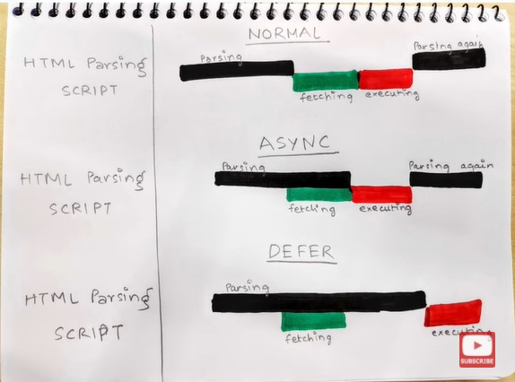

**Async allows execution of scripts asynchronously and defer allows execution only after the whole document has been parsed. They allow the elimination of render-blocking JavaScript where the page would have to load and execute scripts before finishing to render the page**

### ASYNC

**With async, the file gets downloaded asynchronously and then executed as soon as it’s downloaded.**

### DEFER

**With defer, the file gets downloaded asynchronously, but executed only when the document parsing is completed, With defer, scripts will execute in the same order as they are called**

